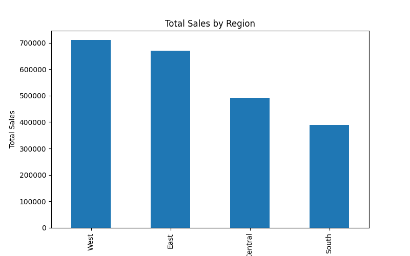
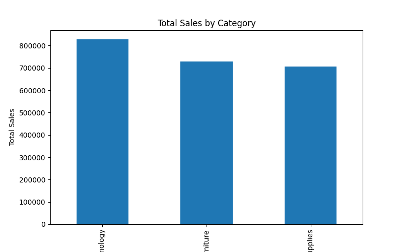
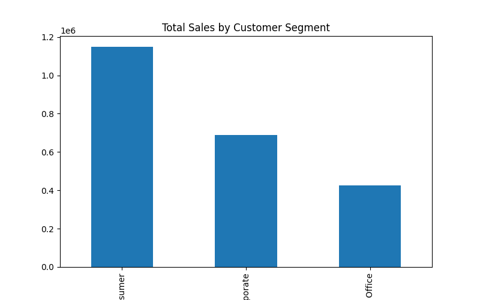
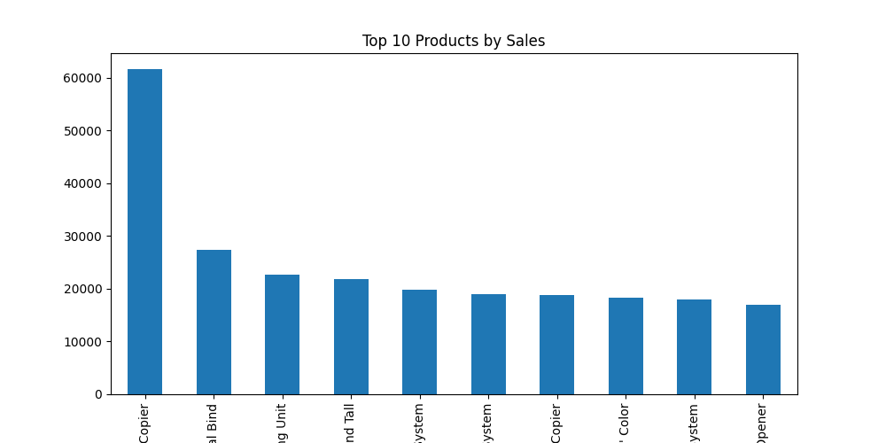
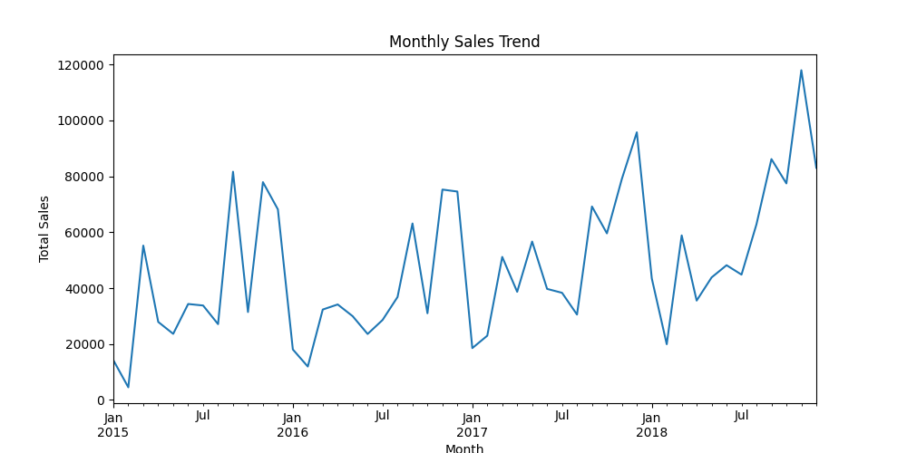

# Data Analytics Portfolio

Spencer Rosenberry  
Computer Science – Data Analytics  

Python | SQL | Tableau | Business Intelligence

I analyze operational datasets and build dashboards that transform raw data into actionable insights.

---

# Projects

## Sales Analytics Dashboard

Python | Pandas | Data Visualization

This project analyzes a retail sales dataset to identify revenue trends, top-performing products, and regional sales performance.

### Key Insights

• The West region generated the highest total revenue  
• Technology products drove the largest category sales  
• Consumer customers accounted for the majority of revenue  

### Visualizations

### Sales by Region

### Sales by Category

### Sales by Segment

### Top Products

### Monthly Sales Trend

---

## Upcoming Projects

• Customer Churn Prediction  
• Healthcare Data Analysis  
• SQL Business Intelligence Dashboard

# Customer Churn Analysis

## Overview
This project analyzes customer churn behavior using a telecom dataset. The goal is to identify patterns that predict whether a customer will cancel their service and provide business insights that could help reduce churn.

## Dataset
Telco Customer Churn dataset containing 7,043 customers and 21 features including:

• tenure  
• MonthlyCharges  
• Contract type  
• Payment method  
• Customer churn status  

## Tools Used
Python  
Pandas  
Matplotlib  
Seaborn  
Scikit-learn  

## Analysis Performed

The analysis explored:

• churn distribution across customers  
• churn differences by contract type  
• relationship between monthly charges and churn  
• predictive modeling using a Random Forest classifier  

## Model Performance

Random Forest classifier achieved approximately **75.9% accuracy** predicting customer churn using tenure and monthly charges as predictors.

## Key Insights

• Customers with **month-to-month contracts churn far more often** than long-term contracts.  
• **Higher monthly charges correlate with increased churn risk.**  
• Customers with **short tenure are significantly more likely to leave.**

## Visualizations

### Churn Distribution

### Churn by Contract Type

### Monthly Charges vs Churn

### Feature Importance

## Author
Spencer Rosenberry  
Computer Science – Data Analytics  
Army Veteran
