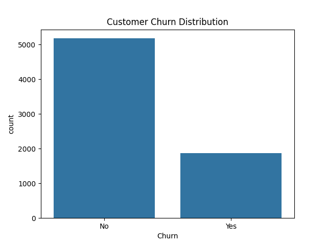
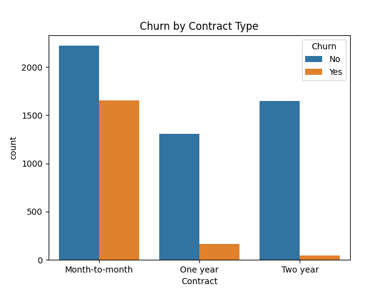
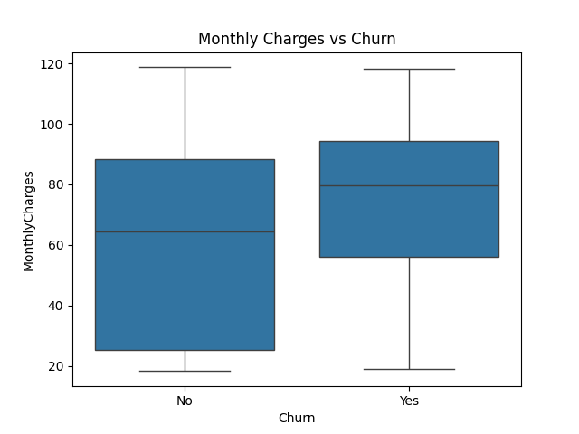
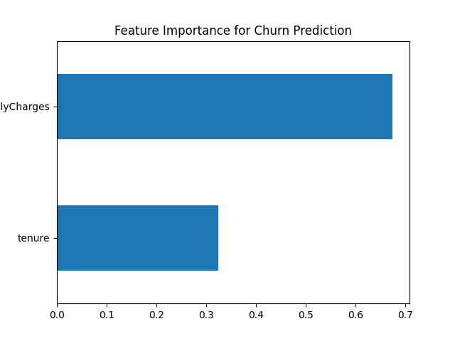

# Data Analytics Portfolio

Spencer Rosenberry  
Computer Science – Data Analytics  

Python | SQL | Tableau | Business Intelligence

I analyze operational datasets and build dashboards that transform raw data into actionable insights.

---

# Projects

## Sales Analytics Dashboard

Python | Pandas | Data Visualization

This project analyzes a retail sales dataset to identify revenue trends, top-performing products, and regional sales performance.

### Key Insights

• The West region generated the highest total revenue  
• Technology products drove the largest category sales  
• Consumer customers accounted for the majority of revenue  

### Visualizations

### Sales by Region

### Sales by Category

### Sales by Segment

### Top Products

### Monthly Sales Trend

---

## Upcoming Projects

• Customer Churn Prediction  
• Healthcare Data Analysis  
• SQL Business Intelligence Dashboard

# Customer Churn Analysis

## Overview
This project analyzes customer churn behavior using a telecom dataset. The goal is to identify patterns that predict whether a customer will cancel their service and provide business insights that could help reduce churn.

## Dataset
Telco Customer Churn dataset containing 7,043 customers and 21 features including:

• tenure  
• MonthlyCharges  
• Contract type  
• Payment method  
• Customer churn status  

## Tools Used
Python  
Pandas  
Matplotlib  
Seaborn  
Scikit-learn  

## Analysis Performed

The analysis explored:

• churn distribution across customers  
• churn differences by contract type  
• relationship between monthly charges and churn  
• predictive modeling using a Random Forest classifier  

## Model Performance

Random Forest classifier achieved approximately **75.9% accuracy** predicting customer churn using tenure and monthly charges as predictors.

## Key Insights

• Customers with **month-to-month contracts churn far more often** than long-term contracts.  
• **Higher monthly charges correlate with increased churn risk.**  
• Customers with **short tenure are significantly more likely to leave.**

## Visualizations

### Churn Distribution

### Churn by Contract Type

### Monthly Charges vs Churn

### Feature Importance

## Author
Spencer Rosenberry  
Computer Science – Data Analytics  
Army Veteran

# SQL Business Intelligence Dashboard

## Overview

This project analyzes retail sales data using SQL and Python to generate key business performance metrics and visual dashboards. The goal is to demonstrate how SQL queries can be used to answer common business intelligence questions related to revenue performance, customer behavior, product demand, and regional sales trends.

The project combines SQL querying, data analysis, and data visualization to transform raw transactional data into actionable business insights.

---

## Tools Used

Python  
SQL (SQLite)  
Pandas  
Matplotlib  
Jupyter Notebook  

---

## Dataset

The dataset contains retail sales transaction records including:

- Order information
- Customer details
- Product categories
- Geographic regions
- Sales revenue

Each row represents a completed customer order.

---

## Key Business Questions

This project answers several common business intelligence questions:

- What is the company’s total revenue?
- Which regions generate the most sales?
- Which product categories perform best?
- Who are the highest value customers?
- Which products generate the most revenue?
- How do sales trends change over time?

---

## Key Insights

- The **West region generates the highest overall revenue**, indicating strong demand in that market.
- **Technology and Furniture products contribute significantly to total sales**, suggesting higher value products drive revenue.
- A **small number of customers account for a large portion of total sales**, highlighting the importance of customer retention strategies.
- **Premium office equipment products appear frequently among the top sellers**, indicating strong demand for high-value items.
- **Monthly sales trends fluctuate throughout the year**, suggesting seasonal purchasing patterns.

---

## Visualizations

### Revenue by Region

This chart shows total revenue generated in each geographic region. The West and East regions contribute the largest share of total sales.

---

### Sales by Category

This visualization compares total revenue generated by each product category.

---

### Top 10 Customers by Sales

This chart highlights the customers who contribute the most revenue to the business.

---

### Top 10 Products by Sales

This visualization identifies the products generating the highest total sales.

---

### Monthly Sales Trend

This chart shows how sales fluctuate over time and helps identify potential seasonal trends.

---

## SQL Queries

The SQL queries used to generate business KPIs are stored in:
